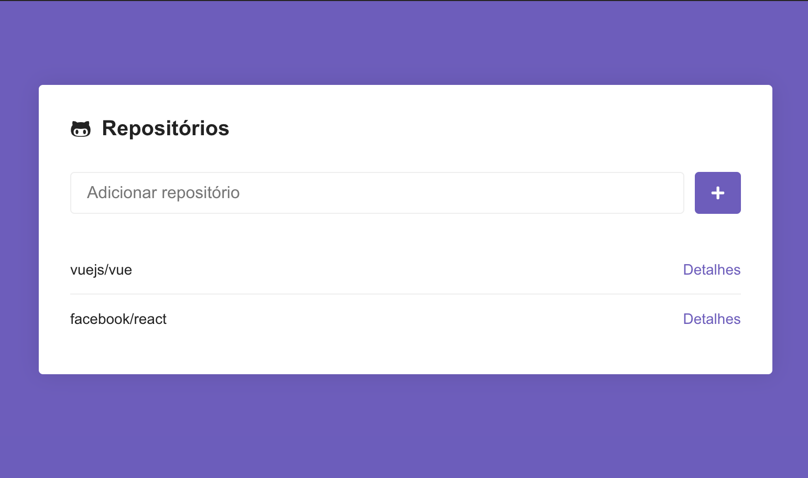

# Desafio 05: Primeiro Projeto com ReactJS

<h1 align="center">
    
</h1>

## About

A simple react app to add repositories to a list saved on local storage and see repository details, filtering by issues and paginate.

## Installation

Clone the project with

```sh
git clone https://github.com/cadohr/rocketseat-bootcamp-desafio05.git
```

Get in the project path

```sh
cd rocketseat-bootcamp-desafio05
```

Then install the dependencies with:

```sh
yarn
```

Start application with:

```sh
yarn start
```

Open browser on:

```sh
localhost:3000
```

## Screenshot


